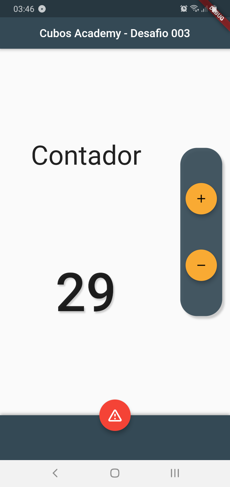
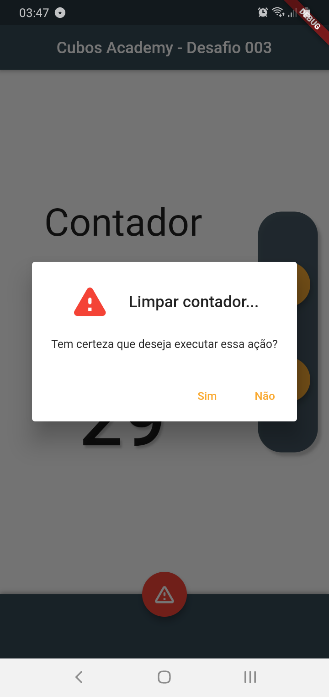

<h1 align="center">
    Cubos Academy  
</h1>

 Modularizar o Contador 
  

[//]: # (Adicione seus gifs / imagens aqui:)

 
   

   
  
  
  

## **Informações:**
[//]: # (Descreva seu objetivo e o que foi usado no projeto:)

* <i><h3><strong>Desafio</strong></h3></i>
  
Treinar funções e classes melhorando nosso contador. Na aula M01 - A04 - Reconstruindo o App Demo nós tivemos como exercício a adição de um botão e a lógica para reduzir o contador.

* Deve ser criado um componente para o FloatActionButton. Lmebre-se que ele vai precisar receber o Icon e a Função onPressed como parâmetro.
  
* A função que realiza a operação deve ser a mesma e receber a operação como parametro. Ou seja, não devemos ter uma função de soma e outra de subtração, vamos ter uma única função que vai realizar a operação correta de acordo com um parâmetro.

<h2> <strong>Quer ir adiante?</strong> </h2>

* Criar funções para cada operação (add e sub) e passá-la como parâmetro para a função que executa a operação.

* [X] Criar uma branch para o exercicio M01 - A06 git checkout -b nome-da-branch para criar uma branch nova

* [x] Adicionar as mudanças aos commits (git add . para adicionar todos os arquivos ou git add nome_do_arquivo para adicionar um arquivo específico)

* [x] Commitar a cada mudança significativa ou na finalização do exercício (git commit -m "Mensagem do commit")
  

## **Linguagens e Ferramentas:**
[//]: # (Adicione os recursos do seu projeto aqui:)

- <code></code> **Flutter**
- <code></code> **Dart**